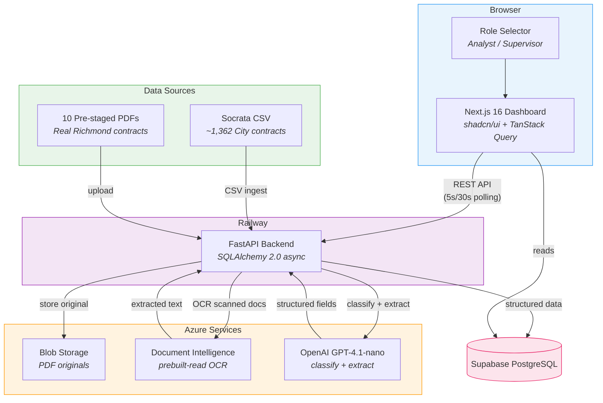
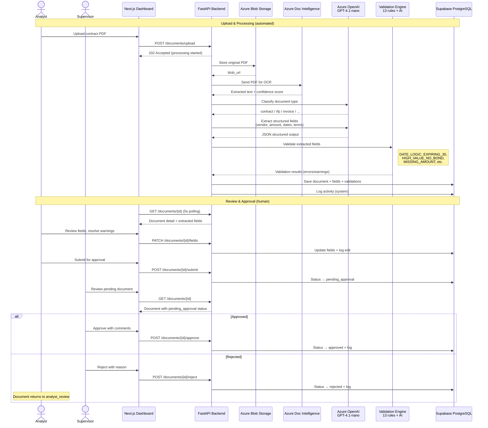
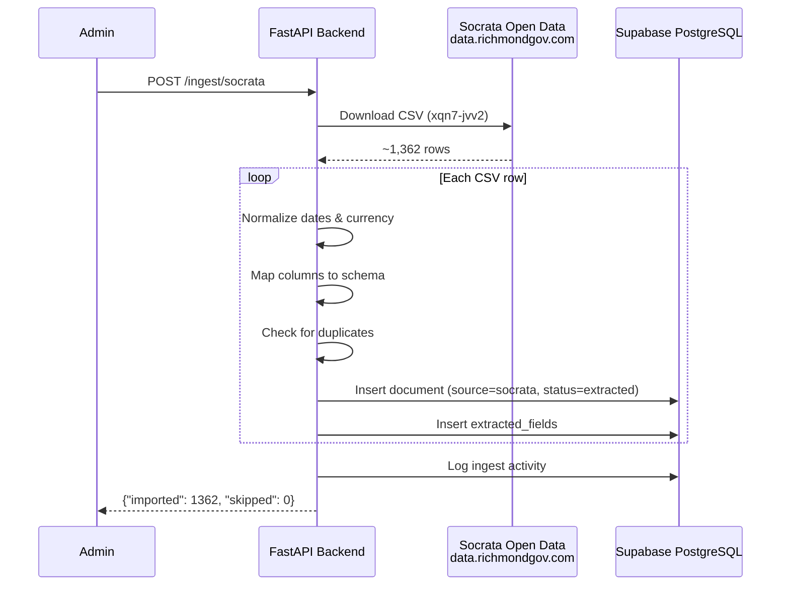

# Procurement Document Processing

AI-powered procurement document processing for the City of Richmond. Staff upload scanned contracts, RFPs, and invoices — AI extracts structured data in seconds, validates for risks, and surfaces expiring contracts on a live dashboard. Built with real City data for HackathonRVA 2026.

**Pillar:** A Thriving City Hall | **Problem:** Helping City Staff Review Procurement Risks and Opportunities

> This is a decision-support tool. AI-assisted extractions require human review.

## Architecture



## Data Flow — Document Processing Pipeline



## Socrata Data Ingest Flow



| Layer | Tech | Directory |
|---|---|---|
| Backend API | FastAPI, SQLAlchemy 2.0 async, OpenAI SDK, Azure DI, Azure Blob | [`procurement/backend/`](procurement/backend/) |
| Frontend | Next.js 16, shadcn/ui, TanStack Query, Recharts | [`procurement/frontend/`](procurement/frontend/) |
| OCR | Azure Document Intelligence (`prebuilt-read`) | external |
| AI | Azure OpenAI GPT-4.1-nano (~$0.002/doc) | external |
| Storage | Azure Blob Storage + Supabase PostgreSQL | external |
| Data Sources | Socrata CSV, 10 pre-staged contract PDFs | [`pillar-thriving-city-hall/procurement-examples/`](pillar-thriving-city-hall/procurement-examples/) |
| API Contract | OpenAPI 3.1.0 | [`procurement/docs/openapi.yaml`](procurement/docs/openapi.yaml) |

## Key Features

- **PDF Upload + AI Extraction** — Upload scanned procurement documents, get structured fields in ~20 seconds
- **Real City Data** — ~1,362 contracts from Richmond's Socrata open data portal
- **Risk Dashboard** — Surfaces expiring contracts (30/60/90 days), missing bonds, high-value anomalies
- **13 Validation Rules + AI Consistency Check** — Catches date logic errors, missing fields, OCR issues
- **Approval Workflow** — Analyst reviews and submits, supervisor approves/rejects (separation of duties)
- **Role-Based Views** — Analyst and supervisor see appropriate actions

## Quick Start

### Prerequisites

- Python 3.12+
- Node.js 20+
- Supabase project (free tier)
- Azure OpenAI, Document Intelligence, and Blob Storage resources

### Backend

```bash
cd procurement/backend
cp .env.example .env          # fill in your credentials
python3 -m venv .venv
.venv/bin/pip install -r requirements.txt
.venv/bin/uvicorn app.main:app --reload
```

Runs on `http://localhost:8000`. Health check: `GET /health`.

### Frontend

```bash
cd procurement/frontend
npm install
npm run dev
```

Runs on `http://localhost:3000`. Set `NEXT_PUBLIC_API_URL=http://localhost:8000` in `.env.local`.

### Load Socrata Data

Once the backend is running:

```bash
curl -X POST http://localhost:8000/api/v1/ingest/socrata
```

Imports ~1,362 real City of Richmond contracts.

## Environment Variables

### Backend (`procurement/backend/.env`)

| Variable | Description |
|---|---|
| `DATABASE_URL` | Supabase PostgreSQL connection (`postgresql+asyncpg://...`) |
| `AZURE_BLOB_CONNECTION_STRING` | Azure Blob Storage connection string |
| `AZURE_BLOB_CONTAINER_NAME` | Blob container name (default: `procurement-docs`) |
| `AZURE_DI_ENDPOINT` | Azure Document Intelligence endpoint |
| `AZURE_DI_KEY` | Azure Document Intelligence key |
| `AZURE_OPENAI_ENDPOINT` | Azure OpenAI endpoint |
| `AZURE_OPENAI_KEY` | Azure OpenAI API key |
| `AZURE_OPENAI_DEPLOYMENT` | Deployment name (default: `gpt-4.1-nano`) |
| `CORS_ORIGINS` | Allowed origins (default: `http://localhost:3000`) |

### Frontend (`procurement/frontend/.env.local`)

| Variable | Description |
|---|---|
| `NEXT_PUBLIC_API_URL` | Backend API base URL (default: `http://localhost:8000`) |

## Approval Workflow


- **Analyst:** uploads, reviews extracted fields, resolves warnings, submits for approval
- **Supervisor:** approves or rejects with comments, can override fields
- Analysts cannot approve their own reviews (separation of duties)

## Tests

```bash
# Backend
cd procurement/backend
.venv/bin/python -m pytest -v        # 27 tests

# Frontend
cd procurement/frontend
npx tsc --noEmit                     # type-check
npm run build                        # build verification
```

## Team

- **Priyesh** — Backend (FastAPI, AI pipeline, Azure integrations)
- **Daniel** — Frontend (Next.js dashboard)

## License

Built for HackathonRVA 2026. Not for production use.
