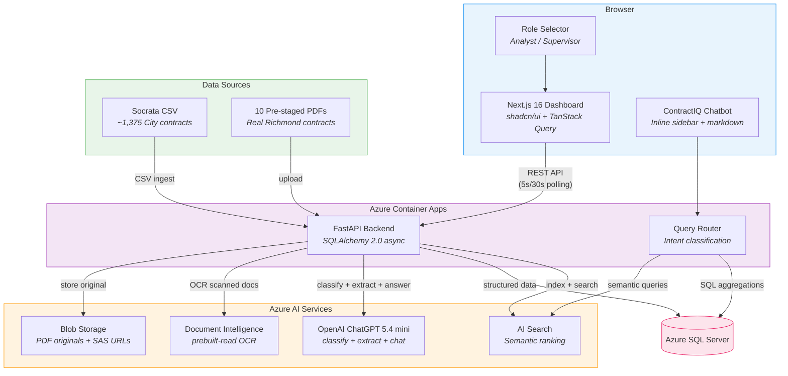
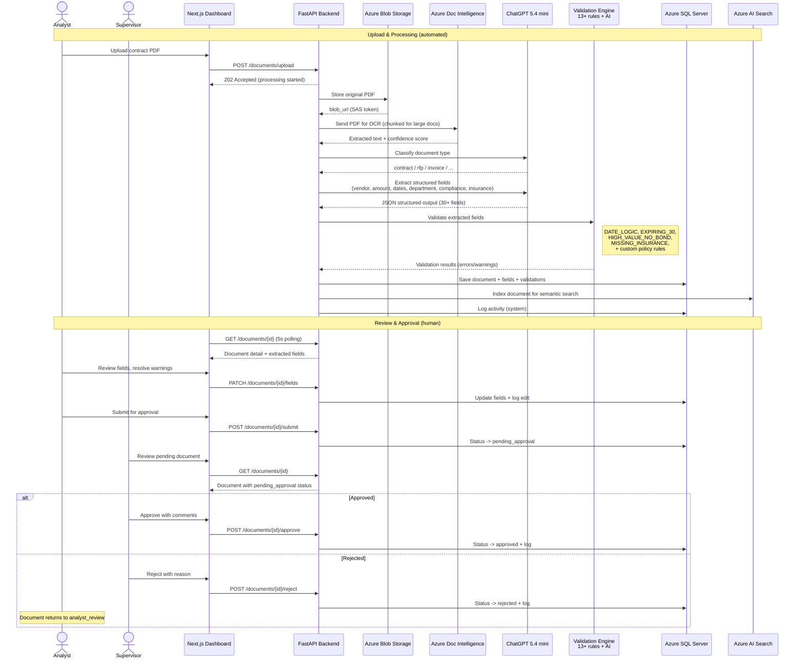
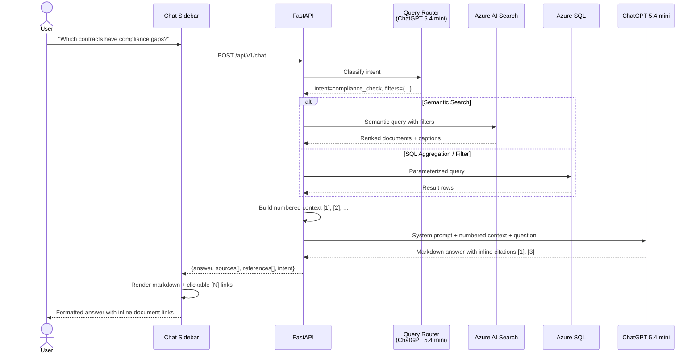
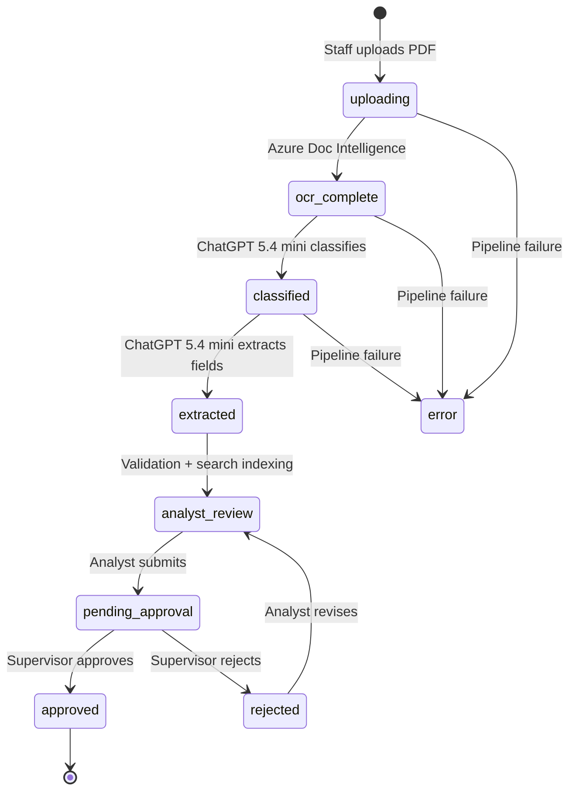

# ContractIQ — City of Richmond Procurement Intelligence

AI-powered procurement document processing for the City of Richmond. Staff upload scanned contracts, RFPs, and invoices — AI extracts structured data in seconds, validates for risks, and surfaces actionable intelligence on a live dashboard. A semantic chatbot answers natural language questions across 1,375+ contracts with inline document citations.

**Pillar:** A Thriving City Hall | **Problem:** Helping City Staff Review Procurement Risks and Opportunities

> This is a decision-support tool. AI-assisted extractions require human review.

## Architecture



## Data Flow — Document Processing Pipeline



## Chatbot & Semantic Search Flow



| Layer | Tech | Directory |
|---|---|---|
| Backend API | FastAPI, SQLAlchemy 2.0 async, OpenAI SDK, Azure DI, Azure Blob | [`procurement/backend/`](procurement/backend/) |
| Frontend | Next.js 16, shadcn/ui, TanStack Query, Recharts | [`procurement/frontend/`](procurement/frontend/) |
| OCR | Azure Document Intelligence (`prebuilt-read`) | external |
| AI | Azure OpenAI ChatGPT 5.4 mini (classify + extract + chat) | external |
| Semantic Search | Azure AI Search (semantic ranker, 22-field index) | external |
| Storage | Azure Blob Storage + Azure SQL Server | external |
| Deployment | Azure Container Apps (Consumption plan) | external |
| Container Registry | Azure Container Registry (Basic) | external |
| Data Sources | Socrata CSV (~1,375 contracts), 10 pre-staged PDFs | [`pillar-thriving-city-hall/procurement-examples/`](pillar-thriving-city-hall/procurement-examples/) |
| API Contract | OpenAPI 3.1.0 (v2.0.0, 40+ endpoints) | [`procurement/docs/openapi.yaml`](procurement/docs/openapi.yaml) |

## Key Features

### Document Processing
- **PDF Upload + AI Extraction** — Upload scanned procurement documents, get 30+ structured fields in ~20 seconds
- **Real City Data** — ~1,375 contracts from Richmond's Socrata open data portal
- **Configurable Validation Rules** — 13+ built-in rules + custom policy rules (threshold, semantic, required field, date window)
- **Approval Workflow** — Analyst reviews and submits, supervisor approves/rejects (separation of duties)
- **Document Annotations** — Click-to-annotate on OCR text with team collaboration

### Intelligence & Search
- **Semantic Search** — Azure AI Search with semantic re-ranking across all contracts (natural language queries)
- **AI Query Router** — Classifies questions into 8 intent types and dispatches to the right execution path
- **Intelligence Dashboard** — Compliance gaps, vendor concentration risk, sole-source review, department spend
- **Department Spend Analysis** — Interactive bar chart with drill-down via chatbot

### ContractIQ Chatbot
- **Inline Sidebar** — Opens alongside the dashboard without blocking content
- **Context-Aware** — Different suggested questions per page; document detail page pre-loads context
- **Intent Classification** — Shows query type badge (Semantic Search, Aggregation, Compliance Check, etc.)
- **Inline Citations** — Numbered `[1]`, `[2]` references in the answer link directly to source documents
- **Markdown Rendering** — Headings, bold, lists, code blocks rendered in the chat panel
- **Source Documents** — Every answer backed by clickable source chips with relevance scores

### Risk & Compliance
- **Expiring Contracts** — 30/60/90 day alerts with reminder scheduling
- **Compliance Gap Detection** — Surfaces contracts missing MBE/WBE, insurance, procurement method
- **Vendor Concentration** — Identifies vendors with multiple high-value contracts
- **Sole-Source Review** — Flags sole-source contracts above threshold for justification review

## Quick Start

### Prerequisites

- Python 3.12+
- Node.js 20+
- ODBC Driver 18 for SQL Server
- Azure OpenAI, Document Intelligence, Blob Storage, AI Search, and SQL Server resources

### Backend

```bash
cd procurement/backend
cp .env.example .env          # fill in your credentials
python3 -m venv .venv
.venv/bin/pip install -r requirements.txt
.venv/bin/uvicorn app.main:app --reload
```

Runs on `http://localhost:8000`. Health check: `GET /health`. API docs: `GET /docs`.

### Frontend

```bash
cd procurement/frontend
npm install
npm run dev
```

Runs on `http://localhost:3000`. Set `NEXT_PUBLIC_API_URL=http://localhost:8000` in `.env.local`.

### Load Socrata Data

Once the backend is running:

```bash
curl -X POST http://localhost:8000/api/v1/ingest/socrata
```

Imports ~1,375 real City of Richmond contracts.

### Initialize Search Index

```bash
# Create the Azure AI Search index
curl -X POST http://localhost:8000/api/v1/admin/ensure-index

# Index all documents (supervisor role required)
curl -X POST http://localhost:8000/api/v1/admin/reindex \
  -H "X-User-Role: supervisor"
```

## Environment Variables

### Backend (`procurement/backend/.env`)

| Variable | Description |
|---|---|
| `DATABASE_URL` | Azure SQL Server connection (`mssql+aioodbc://...`) |
| `AZURE_BLOB_CONNECTION_STRING` | Azure Blob Storage connection string |
| `AZURE_BLOB_CONTAINER_NAME` | Blob container name (default: `procurement-docs`) |
| `AZURE_DI_ENDPOINT` | Azure Document Intelligence endpoint |
| `AZURE_DI_KEY` | Azure Document Intelligence key |
| `AZURE_OPENAI_ENDPOINT` | Azure OpenAI endpoint (with `/openai/v1/` path) |
| `AZURE_OPENAI_KEY` | Azure OpenAI API key |
| `AZURE_OPENAI_DEPLOYMENT` | Deployment name (default: `gpt-5.4-mini`) |
| `AZURE_SEARCH_ENDPOINT` | Azure AI Search endpoint |
| `AZURE_SEARCH_KEY` | Azure AI Search admin key |
| `AZURE_SEARCH_INDEX` | Search index name (default: `contracts`) |
| `AZURE_FOUNDRY_ENDPOINT` | Azure AI Foundry project endpoint |
| `CORS_ORIGINS` | Allowed origins (default: `http://localhost:3000`) |

### Frontend (`procurement/frontend/.env.local`)

| Variable | Description |
|---|---|
| `NEXT_PUBLIC_API_URL` | Backend API base URL (default: `http://localhost:8000`) |

## Approval Workflow



- **Analyst:** uploads, reviews extracted fields, resolves warnings, submits for approval, chats with ContractIQ
- **Supervisor:** approves or rejects with comments, can override fields, manages validation rules
- Analysts cannot approve their own reviews (separation of duties)

## Tests

```bash
# Backend
cd procurement/backend
.venv/bin/python -m pytest -v        # 87+ tests

# Frontend
cd procurement/frontend
npx tsc --noEmit                     # type-check
npm run build                        # build verification
```

## Team

- **Priyesh** — Backend (FastAPI, AI pipeline, Azure integrations, semantic search)
- **Daniel** — Frontend (Next.js dashboard, chatbot UX)

## License

Built for HackathonRVA 2026. Not for production use.
